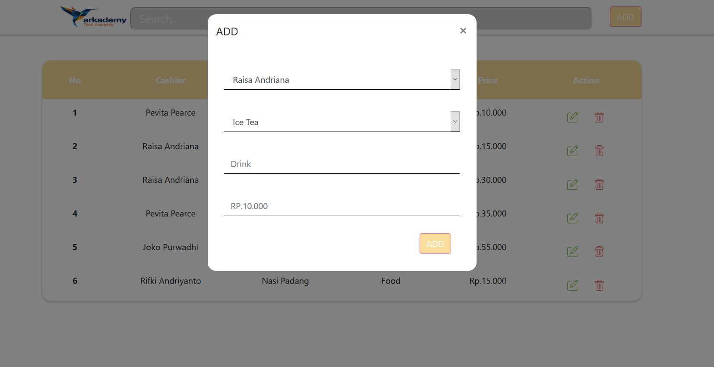
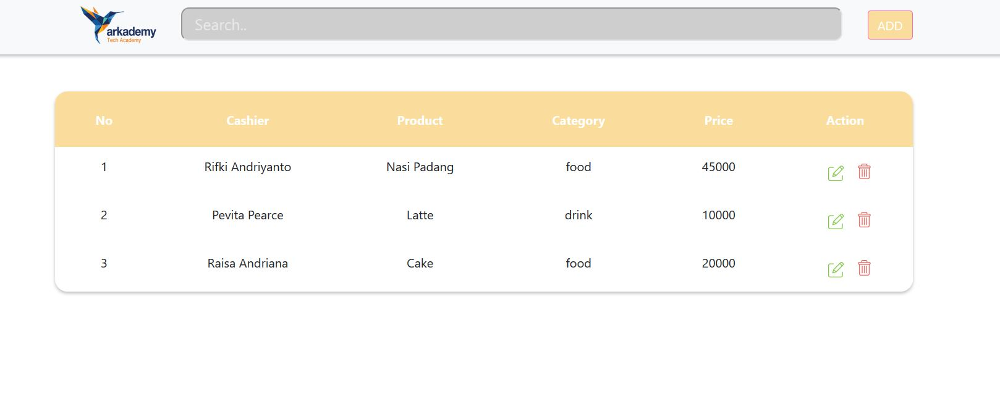

#BOOTCAMP-ARKADEMY-BATCH-15-KLOTER-1
 
 
Salah satu kegunaan JSON pada REST API adalah untuk membuat database dummy agar dapat digunakan dengan cepat  
fungsi JSON pada Rest Api adalah sebagai format untuk mentransmisikan data dari WEB API(server) ke client atau sebaliknya 
 
**_Keterangan_**  

1\. Jawaban biodata dengan bahasa pemrogaman php 
2\.Jawaban menggunakan bahasa pemrograman php REGEX 
3\. Jawaban dengan bahasa pemrogaman php fungsi str_split dan ctype_alpha 
4\. Jawaban dengan bahasa pemrogaman php fungsi str_replace 
5\. dibuat dengan bahasa pemrogaman Jika ERROR di jalankan di LOCALHOST coba di [sini]( https://www.onlinegdb.com/)  
6a\.  
      
6b\.  
      
      
6c\.  
      
